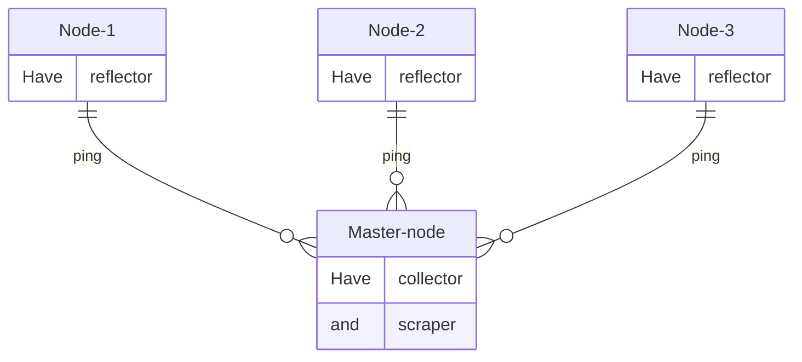

# Llama

<details>
<summary>
<h3>Содержание</h3>
</summary>
    
- [Введение](#введение)
- [С чего начать?](#с-чего-начать)
    - [Шаг 0. Требования и напутствия](#шаг-0-требования-и-напутствия)
    - [Шаг 1. Terraform и Openstack](#шаг-1-terraform-и-openstack)
    - [Шаг 2. Связность серверов](#шаг-2-связность-серверов)
    - [Шаг 3. Запуск LLama](#шаг-3-запуск-llama)
- [Быстрый запуск](#быстрый-запуск)
- [P.S.](#ps)
</details>


<h1 align="center">Развертывание LLAMA в Grafana с помощью Terrafrom и Ansible</a> 
</h1>

### Введение

LLAMA (Loss and Latency MAtrix) - это библиотека для тестирования и измерения сетевых потерь и задержек между распределенными конечными точками. Ссылка на [проект](https://github.com/dropbox/llama).

Collector отправляет UDP-пакет (зонд) на прослушиваемый порт reflector и измеряет, сколько времени требуется для их возврата.

Архитектура:
- Reflector - Упрощенный демон для приема зондов и отправки их обратно к источнику.
- Collector - Отправляет зонды reflector на нескольких портах, записывает результаты и представляет данные через REST API.
- Scraper - Извлекает результаты из REST API из collector и записывает в базу данных InfluxDB.



# С чего начать?

## Шаг 0. Требования и напутствия

Во избежания вопросов внимательно ознакомтесь с данным разделом.

1. Запуск проекта происходил с `Ubuntu 20.04 LTS 64-bit`, на других Ubuntu дистрибутивах не проверялось. 
         
   Работа проекта предназначена **только** для серверов с дистрибутивом **ubuntu**.

   <details>
   <summary>Названи образов Ubuntu, с которыми LLAMA будет работать</summary>

   - Ubuntu 16.04 LTS 64-bit 
   - Ubuntu 18.04 LTS 64-bit 
   - Ubuntu 20.04 LTS 64-bit 
   - Ubuntu 22.04 LTS 64-bit 
   </details>

2. Доступ к использованию  docker, его образов и контейнеров будет иметь **только root** пользователь. Если вы хотите, чтобы другие пользователи могли пользоваться, а следовательно, видеть образы и контейнеры, то добавьте пользователей в группу `sudo usermod -aG docker <username>`.

3. Используемые версии в docker образах:
- `Influxdb v1.8.10` (версию v2 не ставить, точно не будет работать. Лучше оставить как есть. [Официальный контейнер](https://github.com/influxdata/influxdata-docker/tree/577416b29d72aa5b7199c4c67702448152219d78/influxdb/1.8/alpine))
- `grafana/grafana:latest` (если после обновления образа перестало работать, то можно вернуться к версии grafana_10.2.1)
- `Модули LLAMA` (официальный хаб [проекта](https://github.com/dropbox/llama))

Также в проекте используется очень удобная утилита [`terraform-inventory`](https://github.com/adammck/terraform-inventory), которая формирует файл со списком хостов и групп (inventory).

4. Обновите репазитории локального сервера, установите `git` и скачайте проект:
```bash
apt update && apt install git -y
```
```bash
git clone https://github.com/LoMkkka/Llama.git
```

## Security

В проекте существуют чувствительные данные на которые необходимо обратить внимание. В файлах `~/Llama/ansible/docker-influxdb/influxdb/defaults/main.yml` и `~/Llama/ansible/docker-llama/scraper/defaults/main.yml` рекомендуется менять только строки связанные с user и password.
```yaml
#influxdb/defaults/main.yml
influxdb_http_ip: localhost
influxdb_http_port: 5086
influxdb_query_logging: false
influxdb_user_username: "test12" #Должны совпадать с llama_influxdb_pass
influxdb_user_password: "privet" #Должны совпадать с llama_influxdb_user
```
*Если нужна более гибкая настройка, то следует более подробно ознакомиться с каждой переменной в [официальном проекте LLAMA](https://github.com/dropbox/llama)*
```yaml
#scraper/defaults/main.yml
llama_collector_hosts: localhost 
llama_collector_port: 14000
llama_influxdb_host: localhost 
llama_influxdb_name: llama
llama_influxdb_pass: privet
llama_influxdb_port: 5086
llama_influxdb_user: test12
llama_interval: 10
```
Напоминаю, что другие пользователи на развернутых серверах будут видеть активные порты, но не какими службами они запущены.

Все скачанные программы с официальных репозиторий

В самом конце будет пункт про пароли.
проверенно на
## Шаг 1. Terraform и Openstack

Первым делом необходима авторизация с Openstack API. Это можно сделать по нашей документации: [Создание сервисного пользователя](https://docs.selectel.ru/cloud/servers/tools/openstack/#создать-сервисного-пользователя) и [Настройка авторизации](https://docs.selectel.ru/cloud/servers/tools/openstack/#настроить-авторизацию).


### Написать про гибкую настройку openstack cli

Если вы работаете с нового сервера, то можно запустить скрипт `prepare.sh`, который развернет необходимую среду для начала работ.
<details>
<summary>Что делает `prepare.sh`?</summary>
asdads
</details>
Убедиться, что вы авторизовались в Openstack API через скачанный файл `source rc.sh`.
   <details>
   <summary>Корректные названия образов Ubuntu и как должен выглядеть кусок кода</summary>

   Имя образов подставляются в файлах `~/Llama/terraform/master/vars.tf` и `~/Llama/terraform/nodes/main.tf`
   
   ``` tf
   #Поиск ID образа (из которого будет создан сервер) по его имени
   data "openstack_images_image_v2" "ubuntu_image" {
     most_recent = true
     visibility  = "public"
     name        = "Ubuntu 20.04 LTS 64-bit" # сюда вставляем название нужного нам образа (не забываем это делать в обоих файлах) 
   }
   ```

   - Ubuntu 16.04 LTS 64-bit (LLAMA работает с этим образом)
   - Ubuntu 18.04 LTS 64-bit (LLAMA работает с этим образом)
   - Ubuntu 20.04 LTS 64-bit (LLAMA работает с этим образом)
   - Ubuntu 22.04 LTS 64-bit (LLAMA работает с этим образом)
    

   </details>
Далее создаем серверы:
- Инициализация рабочего каталога `terraform init` (необходимые terraform-providers уже имеются в данном репозитории)
- Посмотреть какие серверы и параметры будут созданы `terraform plan` 
- Начать создания серверов `terraform apply`

## Шаг 2. Связность серверов
После того как серверы созданы, необходимо убедиться, что они имеют связность между собой.
- Запускаем скрипт `setup2.sh`, который заполняет нужные файлы данными для развертывания проекта.

<details>
<summary>Что делает `setup2.sh`?</summary>
asdads
</details>

- **Дважды** запускаем `ansible-playbook test.yml` в папке `ansible`, который проверит связность между мастером и нодами.

Должны увидеть такую картину:

``` yaml
PLAY RECAP **********************
10.10.1.11                 : ok=3    
10.10.1.114                : ok=3       
10.10.1.151                : ok=3    
10.10.1.199                : ok=3     
45.145.65.25               : ok=3      
```

## Шаг 3. Запуск LLama

После получения положительного результата связности, запускаем playbook `ansible-playbook LLAMA.yml` и ждем...
После успешного развертывания заходим по ip мастера с портом `3000`. Данные для входа выставлены по дефолту `admin/admin`.
Далее заходим в Dashboards/llama и видим следующую картину (для примера некоторые ноды были отключены):


- Rtt - время приема-передачи
- Loss in time - промежуток времени в который нода была перезагружена/недоступна и т.д.

Алерт в телеграмме:

 


- 'B' - текущий Rtt ноды
- 'C' - статус ноды (1- выключена, 0 - включена) 

<details>
<summary><h2>Быстрый запуск</h2></summary>

### Запускаем проект MEGALLAMA
    
1. Убедились, что наш сервер на дистрибутиве Ubuntu 20.04 и выполняем:
```bash
apt update && apt install git -y
```
```bash
git clone https://github.com/LoMkkka/Llama.git
```
2. Запускаем скрипт `prepare.sh`.
```bash
~/Llama/prepare.sh
```    
3. Мы авторизовались в openstack api через `source rc.sh`, который был скачан из [Шаг 1. Terraform и Openstack](#шаг-1-terraform-и-openstack).

4. Создаем серверы.
```bash
cd ~/Llama/terraform
terraform init
terraform apply -auto-approve
```
5. После того как серверы создались запуcкаем скрипт `replacer.sh`.
```bash
~/Llama/replacer.sh
```
6. Проверяем связность нод между собой. Когда всплывет запрос об fingerprint ключа ECDSA пишем `yes` и дважды выполняем данный playbook.
```bash
cd ~/Llama/ansible
ansible-playbook test.yml
```
7. Запускаем проект и ждем...
```bash
cd ~/Llama/ansible
ansible-playbook MEGALLAMA.yml
```
8. В конце будет вывод ссылки по которой нужно перейти. Пароль от grafana стандартный admin/admin. В `dashboards` находим llama, переходим по ней и радуемся.


</details>


# P.S.
Файл `alert.yaml` за паролен, т.к. содержит токены в приватный канал телеграмма. Пример шаблона для алертов будет указан по пути `/root/Llama/ansible/docker-grafana/grafana/files/provisioning/alert.yaml`
