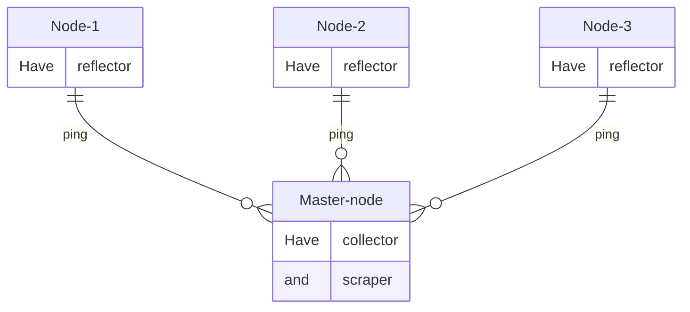

# Llama

<details>
<summary>
<h3>Содержание</h3>
</summary>
    
- [Введение](#введение)
- [С чего начать?](#с-чего-начать)
    - [Шаг 0. Требования и напутствия](#шаг-0-требования-и-напутствия)
    - [Шаг 1. Terraform и Openstack](#шаг-1-terraform-и-openstack)
    - [Шаг 2. Связность серверов](#шаг-2-связность-серверов)
    - [Шаг 3. Запуск LLama](#шаг-3-запуск-llama)
- [Быстрый запуск](#быстрый-запуск)
- [P.S.](#ps)
</details>


<h1 align="center">Развертывание LLAMA в Grafana с помощью Terrafrom и Ansible</a> 
</h1>

### Введение

LLAMA (Loss and Latency MAtrix) - это библиотека для тестирования и измерения сетевых потерь и задержек между распределенными конечными точками. Ссылка на [проект](https://github.com/dropbox/llama).

Collector отправляет UDP-пакет (зонд) на прослушиваемый порт reflector и измеряет, сколько времени требуется для их возврата.

Архитектура:
- Reflector - Упрощенный демон для приема зондов и отправки их обратно к источнику.
- Collector - Отправляет зонды reflector на нескольких портах, записывает результаты и представляет данные через REST API.
- Scraper - Извлекает результаты из REST API из collector и записывает в базу данных InfluxDB.



# С чего начать?

## Шаг 0. Требования и напутствия

Во избежания вопросов внимательно ознакомьтесь с данным разделом.

1. Запуск проекта происходил с `Ubuntu 20.04 LTS 64-bit`, на других Ubuntu дистрибутивах не проверялось. 
         
   Работа проекта предназначена **только** для серверов с дистрибутивом **ubuntu**.

   <details>
   <summary>Название образов Ubuntu, с которыми LLAMA будет работать (проверено)</summary>

   - Ubuntu 16.04 LTS 64-bit 
   - Ubuntu 18.04 LTS 64-bit 
   - Ubuntu 20.04 LTS 64-bit 
   - Ubuntu 22.04 LTS 64-bit 
   </details>

2. Доступ к использованию  docker, его образов и контейнеров будет иметь **только root** пользователь. Если вы хотите, чтобы другие пользователи могли пользоваться, а следовательно, видеть образы и контейнеры, то добавьте пользователей в группу `sudo usermod -aG docker <username>`.

3. Используемые версии в docker образах:
- `Influxdb v1.8.10` (версию v2 не ставить, точно не будет работать. Лучше оставить как есть. [Официальный контейнер](https://github.com/influxdata/influxdata-docker/tree/577416b29d72aa5b7199c4c67702448152219d78/influxdb/1.8/alpine))
- `grafana/grafana:latest` (если после обновления образа перестало работать, то можно вернуться к версии grafana_10.2.1)
- `Модули LLAMA` (официальный хаб [проекта](https://github.com/dropbox/llama))

Также в проекте используется очень удобная утилита [`terraform-inventory`](https://github.com/adammck/terraform-inventory), которая формирует файл со списком хостов и групп (inventory).

4. Обновите репозитории локального сервера, установите `git` и скачайте проект:
```bash
apt update && apt install git -y
```
```bash
git clone https://github.com/LoMkkka/Llama.git
```

5. Безопасность

   В проекте существуют чувствительные данные на которые необходимо обратить внимание. В файлах `~/Llama/ansible/docker-influxdb/influxdb/defaults main. yml` и `~/Llama/ansible/docker-llama/scraper/defaults/main.yml` рекомендуется менять только строки связанные с user и password.
   ```yaml
   #influxdb/defaults/main.yml
   influxdb_http_ip: localhost
   influxdb_http_port: 5086
   influxdb_query_logging: false
   influxdb_user_username: "test12" #Должны совпадать с llama_influxdb_pass
   influxdb_user_password: "privet" #Должны совпадать с llama_influxdb_user
   ```
   *Если нужна более гибкая настройка, то следует более подробно ознакомиться с каждой переменной в [официальном проекте LLAMA](https://github.com/dropbox/llama)*
   ```yaml
   #scraper/defaults/main.yml
   llama_collector_hosts: localhost 
   llama_collector_port: 14000
   llama_influxdb_host: localhost 
   llama_influxdb_name: llama
   llama_influxdb_pass: privet
   llama_influxdb_port: 5086
   llama_influxdb_user: test12
   llama_interval: 10
   ```
   Напоминаю, что другие пользователи на развернутых серверах будут видеть активные порты, но не какими службами они запущены.

   #### ***Все программы скачены с официальных репозиториях.***

## Шаг 1. Terraform и Openstack

Первым делом необходима авторизация с Openstack API. Это можно сделать по нашей документации в *базе знаний Selectel*: [Создание сервисного пользователя](https://docs.selectel.ru/cloud/servers/tools/openstack/#создать-сервисного-пользователя) и [Настройка авторизации](https://docs.selectel.ru/cloud/servers/tools/openstack/#настроить-авторизацию).

   Все это ради того, чтобы **terraform** могу управлять ресурсами нашего облака в **openstack**. 

Если вы работаете с нового сервера, то необходимо запустить скрипт `prepare.sh`, который развернет необходимую среду для начала работ.

Убедиться, что вы авторизовались в Openstack API через скачанный файл командой `source rc.sh`.

-----
Если вы хотите другую конфигурацию развертываемых серверов:

   <details>
   <summary>Корректные названия образов Ubuntu и часть кода</summary>

   Имя образа подставляется в файлах `~/Llama/terraform/master/vars.tf` и `~/Llama/terraform/nodes/main.tf`
   
   ``` tf
   #Поиск ID образа (из которого будет создан сервер) по его имени
   data "openstack_images_image_v2" "ubuntu_image" {
     most_recent = true
     visibility  = "public"
     name        = "Ubuntu 20.04 LTS 64-bit" # сюда вставляем название нужного нам образа (не забываем это делать в обоих файлах) 
   }
   ```

   - Ubuntu 16.04 LTS 64-bit (LLAMA работает с этим образом)
   - Ubuntu 18.04 LTS 64-bit (LLAMA работает с этим образом)
   - Ubuntu 20.04 LTS 64-bit (LLAMA работает с этим образом)
   - Ubuntu 22.04 LTS 64-bit (LLAMA работает с этим образом)
    

   </details>

   <details>
   <summary>Место где нужно указывать количество нод </summary>

   В файле `~/Llama/terraform/nodes/vars.tf` указываем желаемое количество нод.

   ```tf
   variable "int_count" {
     type    = number
     default = 3
   }
   ```
   Если число нод большо́е, то рекомендуется использовать следующую команду, которая поможет распараллеливать создание ресурсов и ускорять развертывание:
   ```bash
   terraform apply -parallelism=n 
   ```
   Terraform будет выполнять операции с ресурсами параллельно, используя до n потоков. Применять аккуратно, т.к. это зависит от ресурсов локальной машины.
   </details>

   <details>
   <summary>Если вы хотите просмотреть готовые инстант (flavor) или список развернутых серверов. Пример вывод команд openstack: </summary>

   ```bash
   root@nemaster:~/Llama/files# openstack server list
   +--------------------------------------+----------+--------+-------------------------------------+-------------------------+------------------------------+
   | ID                                   | Name     | Status | Networks                            | Image                   | Flavor                       |
   +--------------------------------------+----------+--------+-------------------------------------+-------------------------+------------------------------+
   | 05505d44-8461-47f4-a36c-15d0c712863e | node-2   | ACTIVE | network_tf=10.10.1.214              |                         | server-node-pYosQNXmtorqwSOE |
   | 4abeee69-cae6-4699-8772-9fba8a6bb9ee | node-1   | ACTIVE | network_tf=10.10.1.8                |                         | server-node-pYosQNXmtorqwSOE |
   | 8c526c73-dd35-4422-b484-c72764e559c6 | node-3   | ACTIVE | network_tf=10.10.1.91               |                         | server-node-pYosQNXmtorqwSOE |
   | dfa9e6fe-6f7a-4f22-9b2c-9f9ae7fff46a | Master   | ACTIVE | network_tf=10.10.1.226, 31.129.33.9 |                         | server-JhQEj4kx67fFEpQP      |
   | dc4c8d3c-73a3-49fe-89b6-550f199d6c99 | nemaster | ACTIVE | nat=192.168.0.2, 46.161.52.66       | Ubuntu 20.04 LTS 64-bit | SL1.1-2048                   |
   +--------------------------------------+----------+--------+-------------------------------------+-------------------------+------------------------------+
   ```

   ```bash
   root@nemaster:~/Llama/files# openstack flavor list
   +--------------------------------------+---------------------------------+--------+------+-----------+-------+-----------+
   | ID                                   | Name                            |    RAM | Disk | Ephemeral | VCPUs | Is Public |
   +--------------------------------------+---------------------------------+--------+------+-----------+-------+-----------+
   | 1                                    | m1.tiny                         |    512 |    0 |         0 |     1 | True      |
   | 1000                                 | BL1.1-512                       |    512 |    0 |         0 |     1 | True      |
   | 1001                                 | BL1.1-1024                      |   1024 |    0 |         0 |     1 | True      |
   | 1002                                 | BL1.1-2048                      |   2048 |    0 |         0 |     1 | True      |
   | 1003                                 | BL1.2-4096                      |   4096 |    0 |         0 |     2 | True      |
   | 1306                                 | BL1.6-32768-256                 |  32768 |  256 |         0 |     6 | True      |
   | 1307                                 | BL1.8-49152-384                 |  49152 |  384 |         0 |     8 | True      |
   | 1308                                 | BL1.10-65536-512                |  65536 |  512 |         0 |    10 | True      |
   | 1311                                 | SL1.1-1024-8                    |   1024 |    8 |         0 |     1 | True      |
   | 1312                                 | SL1.1-2048-16                   |   2048 |   16 |         0 |     1 | True      |
   | 1313                                 | SL1.2-4096-32                   |   4096 |   32 |         0 |     2 | True      |
   | 1314                                 | SL1.2-8192-64                   |   8192 |   64 |         0 |     2 | True      |
   +--------------------------------------+---------------------------------+--------+------+-----------+-------+-----------+
   ```

   Для большей информации о команде `openstack --help`. [Документация](https://registry.terraform.io/providers/terraform-provider-openstack/openstack/latest/docs) о том, как грамотно использовать resource и data sources terraform в связке с openstack. 
   </details>

----

Далее создаем серверы:
- Инициализация рабочего каталога (необходимые terraform-providers уже имеются в данном репозитории)
   ```bash
   terraform init
   ```  
- Посмотреть какие серверы и параметры будут созданы
   ```bash
   terraform plan
   ```  
- Начать создания серверов
   ```bash
   terraform apply
   ```  
   Ожидаем такой вывод:
   ```HCL
   Apply complete! Resources: 19 added, 0 changed, 0 destroyed.
   ```
- Если нужно **удалить** все серверы, то используйте с начала команду `terraform refresh`, и только затем `terraform destroy`
   ```bash
   terraform refresh && terraform destroy
   ``` 
   Получаем такой вывод:
   ```HCL
   Destroy complete! Resources: 19 destroyed.
   ```
## Шаг 2. Связность серверов
После того как серверы созданы, необходимо убедиться, что они имеют связность между собой.
- Запускаем скрипт `replacer.sh`, который заполняет файлы данными, полученными от созданных серверов. Указываем количество нод, которое было создано (master нода не считается)

- **Дважды** запускаем playbook `ansible-playbook test.yml` в папке `~/Llama/ansible/`, который проверит связность между мастером и нодами

```bash
ansible-playbook test.yml
```

Должны увидеть следующую картину:

``` yaml
PLAY RECAP **********************
10.10.1.11                 : ok=3    
10.10.1.114                : ok=3       
10.10.1.151                : ok=3    
10.10.1.199                : ok=3     
45.145.65.25               : ok=3      
```
Что свидетельствует об успешной связности серверов.

## Шаг 3. Запуск LLama

После получения положительного результата связности, запускаем playbook `ansible-playbook LLAMA.yml` в той же папке.

```bash
ansible-playbook LLAMA.yml
```
После развертывания мы получим сообщение о готовности проекта вместе со ссылкой:
```yaml
ok: [10.10.1.86] => {
    "msg": "Ура!!! Проверяй работоспособность MEGALLAMA по ссылке http://5.159.103.10:3000 "
}
```
Переходим по ссылке и вводим данные для входа, которые выставлены по стандарту `admin/admin`. Рекомендуется сразу сменить пароль на более надежный.
Далее заходим в Dashboards/llama и видим следующую картину (для примера некоторые ноды были отключены):


- Rtt - время приема-передачи
- Loss in time - промежуток времени в который нода была перезагружена/недоступна и т.д.

Алерт в телеграмме:

 


- 'B' - текущий Rtt ноды
- 'C' - статус ноды (1- выключена, 0 - включена) 

<details>
<summary><h2>Быстрый запуск</h2></summary>

### Запускаем проект MEGALLAMA
    
1. Убедились, что наш сервер на дистрибутиве Ubuntu 20.04 и выполняем:
```bash
apt update && apt install git -y
```
```bash
git clone https://github.com/LoMkkka/Llama.git
```
2. Запускаем скрипт `prepare.sh`.
```bash
~/Llama/prepare.sh
```    
3. Мы убедились, что авторизовались в openstack api через `source rc.sh`, который был скачан из [Шаг 1. Terraform и Openstack](#шаг-1-terraform-и-openstack).

4. Создаем серверы.
```bash
cd ~/Llama/terraform
terraform init
terraform apply -auto-approve
```
5. После того как серверы создались запускаем скрипт `replacer.sh`.
```bash
~/Llama/replacer.sh
```
6. Проверяем связность нод между собой. Когда всплывет запрос об fingerprint ключа ECDSA пишем `yes` и дважды выполняем данный playbook.
```bash
cd ~/Llama/ansible
ansible-playbook test.yml
```
7. Запускаем проект и ждем...
```bash
cd ~/Llama/ansible
ansible-playbook MEGALLAMA.yml
```
8. В конце будет вывод ссылки по которой нужно перейти. Пароль от grafana стандартный admin/admin. В `dashboards` находим llama, переходим по ней и радуемся.
   
      

</details>


# P.S.
Файл `alert.yaml` за паролен, т.к. содержит токены в приватный канал телеграмма. Пример шаблона для алертов будет указан по пути `~/Llama/ansible/docker-grafana/grafana/files/provisioning/alert1.yaml`. 

Если вы настроили свой алерт, то обязательно откомментируйте следующую строку в файле `~/Llama/ansible/docker-grafana/grafana/files/Dockerfile`:
```yaml
# Если у вас есть готовый шаблон аларом, то откомментируйте строку ниже 
COPY provisioning/alert.yaml     /etc/grafana/provisioning/alerting # не забыть поменять наименования алерт файла
```
