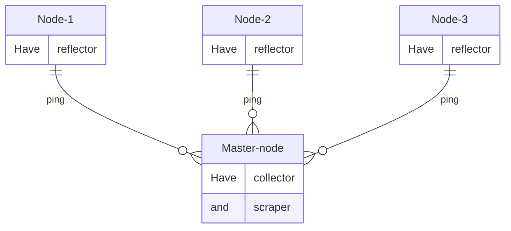

# Llama

<h1 align="center">Развертывание LLAMA в Grafana с помощью Terrafrom и Ansible</a> 
</h1>

LLAMA (Loss and Latency MAtrix) - это библиотека для тестирования и измерения сетевых потерь и задержек между распределенными конечными точками. Ссылка на [проект](https://github.com/dropbox/llama).

Collector отправляет UDP-пакет (зонд) на прослушиваемый порт reflector и измеряет, сколько времени требуется для их возврата.

Архитектура:
- Reflector - Упрощенный демон для приема зондов и отправки их обратно к источнику.
- Collector - Отправляет зонды reflector на нескольких портах, записывает результаты и представляет данные через REST API.
- Scraper - Извлекает результаты из REST API из collector и записывает в базу данных InfluxDB.

## С чего начать?

Terraform и Openstack.

Первым делом необходима авторизация с Openstack API. Это можно сделать по нашей документации: [Создание сервисного пользователя](https://docs.selectel.ru/cloud/servers/tools/openstack/#создать-сервисного-пользователя) и [Настройка авторизации](https://docs.selectel.ru/cloud/servers/tools/openstack/#настроить-авторизацию).

Если вы работаете с нового сервера, то можно запустить скрипт `setup1.sh`, который развернет необходимую среду для начала работ.

Убедиться, что вы авторизовались в Openstack API через скачанный файл `source rc.sh`.

Далее создаем серверы:
- Инициализация рабочего каталога `terraform init` (необходимые terraform-providers уже имеются в данном репозитории)
- Посмотреть какие серверы и параметры будут созданы `terraform plan` 
- Начать создания серверов `terraform apply`

## Связнность серверов
После того как серверы созданы, необходимо убедиться, что они имеют связнность между собой.
- Запускаем скрипт `setup2.sh`, который заполняет нужные файлы данными для развертывания проекта.
- Дважды запускаем `ansible-playbook test.yml` в папке `ansible`, который проверит связность между мастером и нодами.

## Запуск MegaLLama

После получения положительного результата связности, запускаем плейбук `ansible-playbook /root/Llama/ansible/MEGALLAMA.yml` и ждем...
После успешного развертывания заходим по ip мастера с портом `3000`. Данные для входа выставлены по дефолту `admin/admin`.
Далее заходим в Dashboards/llama и видим следующую картину (для примера некоторые ноды были отключены):

- Rtt - время приема-передачи
- Loss in time - промежуток времени в который нода была перезагружена/недоступна и т.д.

Алерт в телеграмме:

 

- 'B', - текущий Rtt ноды
- 'C' - статус ноды (1- выключена, 0 - включена) 

# P.S.
Файл `alert.yaml` запаролен, т.к. содержит токены в приватный канал телеграмма. Пример шаблона для алертов будет указан по пути `Llama/ansible/grafana/files/alert1.yaml` 
